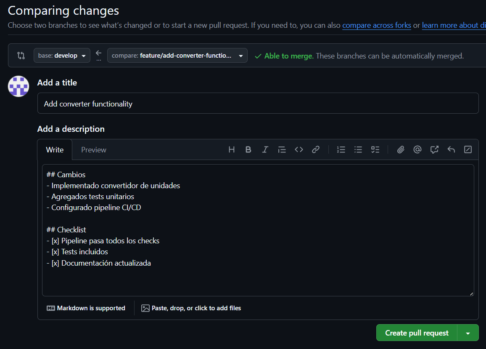
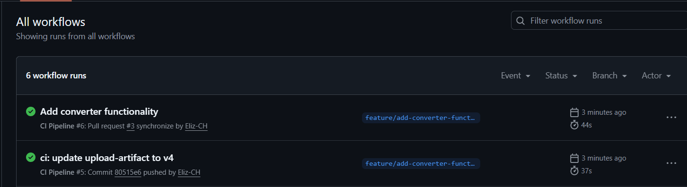
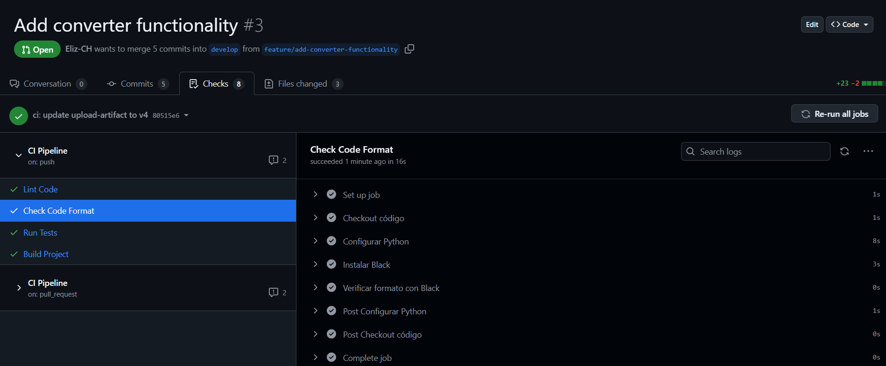
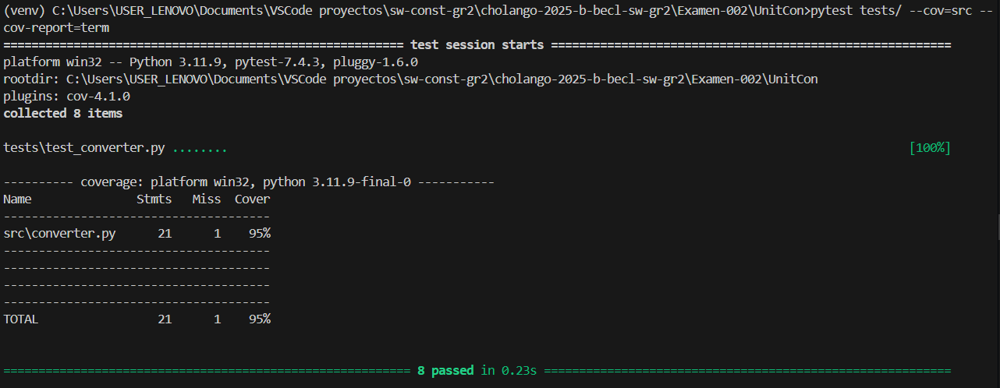
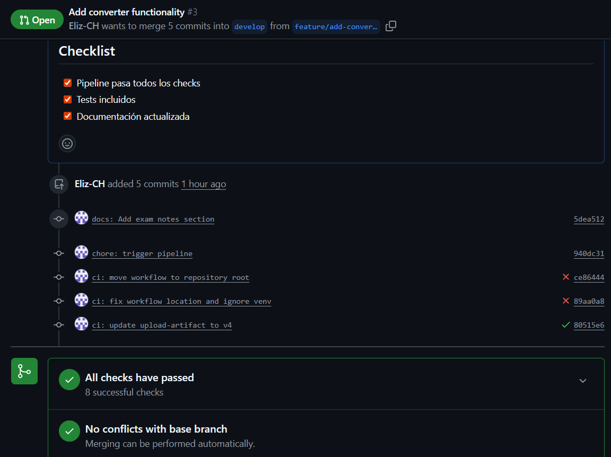
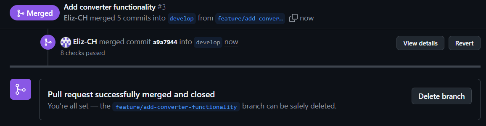

# 🔄 UnitCon

**UnitCon** es un proyecto en Python orientado a la conversión de unidades, desarrollado como parte del examen práctico. El proyecto cuenta con pruebas automatizadas y un pipeline de Integración Continua (CI) configurado con GitHub Actions para garantizar la calidad del código.

---

## 📋 Descripción

UnitCon permite convertir entre diferentes unidades de medida:
- **Temperatura**: Celsius ↔ Fahrenheit
- **Longitud**: Metros ↔ Pies
- **Peso**: Kilogramos ↔ Libras

---

## 📁 Estructura del Proyecto

```
cholango-2025-b-becl-sw-gr2/
├── Examen-002/
│   └── UnitCon/
│       ├── src/
│       │   └── converter.py
│       ├── tests/
│       │   └── test_converter.py
│       ├── requirements.txt
│       └── README.md
├── .github/
│   └── workflows/
│       └── ci.yml
├── .gitignore
└── venv/ (ignorado)
```

---

## 🧰 Requisitos

- Python 3.9 o superior
- Git
- pip

---

## ▶️ Ejecución del proyecto localmente

### 1️⃣ Clonar el repositorio

```bash
git clone <URL-del-repositorio>
cd Examen-002/UnitCon
```

### 2️⃣ Crear y activar entorno virtual

#### Windows

```bash
python -m venv venv
venv\Scripts\activate
```

#### Linux / macOS

```bash
python3 -m venv venv
source venv/bin/activate
```

### 3️⃣ Instalar dependencias

```bash
pip install -r requirements.txt
```

### 4️⃣ Ejecutar el proyecto

```bash
python src/converter.py
```

El programa mostrará un menú interactivo donde podrás seleccionar el tipo de conversión y el valor a convertir.

### 💡 Ejemplo de uso

```
=== Convertidor de Unidades ===

1. Temperatura (Celsius ↔ Fahrenheit)
2. Longitud (Metros ↔ Pies)
3. Peso (Kilogramos ↔ Libras)

Seleccione una opción (1-3): 1
Ingrese el valor a convertir: 25

25.0°C = 77.00°F
25.0°F = -3.89°C
```

---

## 🧪 Ejecución de pruebas

### Ejecutar todas las pruebas

```bash
pytest tests/
```

### Ejecutar pruebas con reporte de cobertura

```bash
pytest tests/ --cov=src --cov-report=term --cov-report=html
```

El reporte HTML se genera en la carpeta `htmlcov/`.

---

## 🔄 Pipeline de Integración Continua (CI)

El proyecto cuenta con un pipeline de CI configurado en GitHub Actions, definido en:

```
.github/workflows/ci.yml
```

### 📌 Eventos que disparan el pipeline

El pipeline se ejecuta automáticamente cuando ocurre alguno de los siguientes eventos:

**Push a las ramas:**
- `main`
- `develop`
- `feature/*`

**Pull Request hacia:**
- `main`
- `develop`

---

## ⚙️ Etapas del pipeline y orden de ejecución

El pipeline se ejecuta en el siguiente orden:

### 1️⃣ **Lint** (Lint Code)

| Característica | Detalle |
|----------------|---------|
| **Herramienta** | Flake8 |
| **Valida** | Estilo de código, errores de sintaxis, buenas prácticas en Python |
| **Falla si** | Existen errores de linting |

```bash
# Ejecutar localmente:
flake8 src/ tests/
```

---

### 2️⃣ **Format** (Check Code Format)

| Característica | Detalle |
|----------------|---------|
| **Herramienta** | Black |
| **Valida** | Que el código cumpla con el formato estándar |
| **Modo** | `--check` (no modifica el código) |

```bash
# Ejecutar localmente:
black --check src/ tests/

# Auto-formatear:
black src/ tests/
```

---

### 3️⃣ **Test** (Run Tests)

| Característica | Detalle |
|----------------|---------|
| **Herramienta** | Pytest |
| **Valida** | Pruebas unitarias y cobertura de código |
| **Genera** | Reporte en consola y reporte HTML de cobertura |

El reporte HTML se sube como artefacto del workflow.

```bash
# Ejecutar localmente:
pytest tests/ --cov=src --cov-report=term --cov-report=html
```

---

### 4️⃣ **Build** (Build Project)

> **Nota:** Se ejecuta **solo si** Lint, Format y Test pasan correctamente.

| Característica | Detalle |
|----------------|---------|
| **Valida** | Sintaxis del archivo principal (`py_compile`) |
| **Genera** | Carpeta `build/` con copia del código fuente y archivo `BUILD_SUCCESS.txt` |

Los artefactos del build se suben al workflow.

```bash
# Ejecutar localmente:
python -m py_compile src/converter.py
```

---

## 📊 Flujo de ejecución del pipeline

```
┌─────────────────────────────────────┐
│   Push / Pull Request               │
└──────────────┬──────────────────────┘
               │
               ▼
┌──────────────────────────────────────┐
│         Pipeline Trigger             │
└──────────────┬───────────────────────┘
               │
      ┌────────┴────────┐
      │                 │
┌─────▼─────┐  ┌────────▼────────┐  ┌─────────▼──────┐
│   Lint    │  │     Format      │  │      Test      │
│ (Flake8)  │  │     (Black)     │  │    (Pytest)    │
└─────┬─────┘  └────────┬────────┘  └─────────┬──────┘
      │                 │                      │
      └─────────────────┴──────────────────────┘
                        │
                        ▼
              ┌─────────────────┐
              │      Build      │
              │  (Solo si pasan │
              │   todos los     │
              │    anteriores)  │
              └─────────────────┘
```

---

## 📦 Artefactos generados por el pipeline

El pipeline genera y almacena los siguientes artefactos:

| Artefacto | Descripción |
|-----------|-------------|
| **coverage-report** | Reporte de cobertura de pruebas en formato HTML |
| **build-artifacts** | Carpeta `build/` con el código compilado y archivo de éxito |

Estos pueden descargarse desde la pestaña **Actions** en GitHub.

---

## 📸 Evidencias de ejecución exitosa

A continuación se muestran las capturas de pantalla que demuestran la ejecución exitosa del pipeline:

### ✅ Creación de Pull Request (PR)



*Pull Request de base: "develop" y compare: "feature"*

---

### ✅ Pipeline completo exitoso



*Vista general del workflow ejecutado correctamente en GitHub Actions*

---

### 🔍 Detalle de los Jobs



*Los 4 jobs (Lint, Format, Test, Build) ejecutados exitosamente*

---

### 🧪 Reporte de cobertura de pruebas



*Reporte de cobertura generado por pytest mostrando >90% de cobertura*

---

### 🔀 Pull Request aprobado



*Pull Request con todos los checks en verde y listo para merge*

---

### 🔀 Merging develop-feature



*Merge entre develop desde feature*

---

## 🧾 Consideraciones adicionales

- ✅ El entorno virtual (`venv`) está correctamente ignorado mediante `.gitignore`
- ✅ El pipeline utiliza versiones actualizadas de las actions oficiales
- ✅ El proyecto sigue una estructura clara y mantenible
- ✅ Todas las pruebas unitarias cubren casos normales y casos edge
- ✅ El código cumple con PEP 8 y está formateado con Black

---

## 🛠️ Tecnologías utilizadas

| Tecnología | Versión | Propósito |
|------------|---------|-----------|
| **Python** | 3.9+ | Lenguaje de programación |
| **Pytest** | 7.4.3 | Framework de testing |
| **pytest-cov** | 4.1.0 | Plugin de cobertura |
| **Flake8** | 6.1.0 | Linter de código |
| **Black** | 23.12.1 | Formateador de código |
| **GitHub Actions** | - | CI/CD Pipeline |

---

## 🚀 Flujo de trabajo con Git

### Crear una nueva feature

```bash
# 1. Actualizar develop
git checkout develop
git pull origin develop

# 2. Crear nueva rama
git checkout -b feature/nombre-de-la-feature

# 3. Hacer cambios y commits
git add .
git commit -m "feat: descripción del cambio"

# 4. Push a GitHub
git push origin feature/nombre-de-la-feature
```

### Crear Pull Request

1. Ve a GitHub y crea un Pull Request desde `feature/*` hacia `develop`
2. Espera a que el pipeline pase ✅
3. Solicita revisión (si aplica)
4. Merge una vez aprobado

---

## 📚 Comandos útiles

### Verificar calidad del código localmente

```bash
# Lint
flake8 src/ tests/

# Format check
black --check src/ tests/

# Tests con cobertura
pytest tests/ --cov=src --cov-report=term

# Build
python -m py_compile src/converter.py
```

### Ver reporte de cobertura HTML

```bash
pytest tests/ --cov=src --cov-report=html
# Abrir htmlcov/index.html en el navegador
```

---

## 👤 Autor

Proyecto desarrollado para el **Examen 02** de Construcción y Evolución de Software.

**Repositorio**: cholango-2025-b-becl-sw-gr2

---

## 📄 Licencia

Este proyecto es de uso académico.

---

## 🆘 Solución de problemas

### El pipeline falla en Lint

```bash
# Ver errores específicos
flake8 src/ tests/

# Auto-formatear puede resolver muchos problemas
black src/ tests/
```

### El pipeline falla en Tests

```bash
# Ver detalles del error
pytest tests/ -v

# Ejecutar un test específico
pytest tests/test_converter.py::TestTemperatureConversion -v
```

### GitHub Actions no se ejecuta

1. Ve a **Settings** → **Actions** → **General**
2. Verifica que Actions esté habilitado
3. Selecciona "Allow all actions and reusable workflows"

---

<div align="center">

**🎓 Proyecto académico - Examen de Construcción y Evolución de Software**

⭐ Si este proyecto te fue útil, no olvides darle una estrella ⭐

</div>