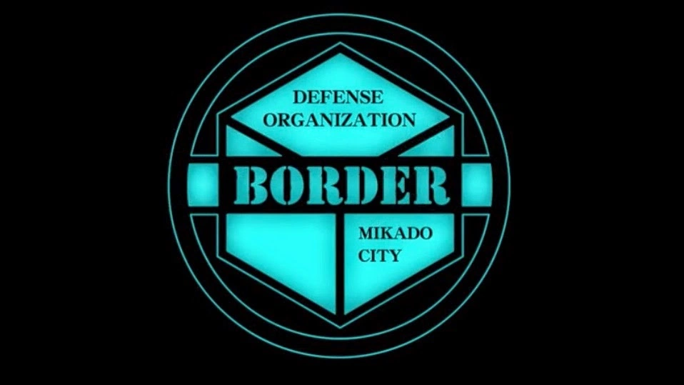

# 📘 Proyecto 02: Documento de Construcción y Evolución de BTMS

## 1. Información

| Campo | Detalle |
|------|--------|
| **Nombre del estudiante** | Belén Cholango |
| **Nombre del proyecto** | BTMS - Border Tactical Management System |
| **Fecha de entrega** | 31 de enero de 2026 |
| **Curso / Materia** | Construcción y Evolución de Software |

---

## 2. Introducción

**BTMS (Border Tactical Management System)** es un sistema de gestión diseñado para la organización **Border**, una entidad de defensa encargada de proteger a la humanidad de amenazas interdimensionales. El sistema centraliza la información de agentes de combate, operadoras tácticas, ingenieros y directivos.

### Border



*Logo de la Organización Border*

### 2.1 Problema que resuelve

Border enfrenta desafíos operativos críticos que afectan la eficiencia de sus operaciones de defensa:

| Problema identificado | Impacto |
|----------------------|---------|
| Dispersión de información de agentes | Dificultad para evaluar rendimiento y tomar decisiones estratégicas |
| Gestión manual de escuadrones | Procesos lentos y propensos a errores en formación de equipos |
| Cálculo manual de rankings | Retrasos en actualización de clasificaciones e inconsistencias |
| Falta de trazabilidad | Imposibilidad de rastrear evolución histórica del desempeño |
| Ausencia de reportería centralizada | Dificultad para presentar métricas a alta dirección |

### 2.2 Contexto operativo

**Clasificación del personal en Border**

**Agentes de Campo**
- Artilleros  
- Francotiradores  
- Asaltantes  
- Tiradores  
- Tramperos  

**Personal Administrativo**
- Operadoras (1 por escuadrón)  
- Ingenieros (desarrollo de equipamiento)  
- Directivos (alta dirección)  

**Estructura de Escuadrones**
- Composición: **1 operadora + 2 a 4 agentes**
- Mínimo: **2 personas**
- Máximo: **5 personas**

### 2.3 Objetivo del documento

Este documento describe cómo se construye, integra y evoluciona el software **BTMS**, cubriendo la arquitectura del sistema, pipelines de CI/CD, flujos de desarrollo, gestión de historias de usuario y herramientas utilizadas.

---

## 3. Arquitectura del Proyecto

### 3.1 Diagrama de alto nivel

```
┌────────────────────────────────────────────────┐
│ CAPA DE PRESENTACIÓN                           |
│ Frontend Web (React + TypeScript)              │
└────────────────────────────────────────────────┘
                    │ HTTP / REST API
                    ▼
┌───────────────────────────────────────────────┐
│ CAPA DE APLICACIÓN                            │
│ API Gateway (Node.js + Express)               │
└───────────────────────────────────────────────┘
    │               │
┌────▼─────┐ ┌──────▼──────┐ ┌──────────┐
│Microserv.│ │Microserv.   │ │Microserv.│
│Agentes   │ │Escuadrones  │ │Rankings  │
└────┬─────┘ └──────┬──────┘ └────┬─────┘
     │              │             │
     └──────────────┴─────────────┘
                    │
┌───────────────────▼────────────────────┐
│ CAPA DE DATOS                          │
│ PostgreSQL (Datos principales)         │
│ MongoDB (Analytics y logs)             │
└────────────────────────────────────────┘
```


### 3.2 Componentes principales

| Componente | Tecnología | Responsabilidad |
|----------|-----------|----------------|
| Frontend Web | React + TypeScript | Interfaz de usuario |
| API Gateway | Node.js + Express | Autenticación JWT y enrutamiento |
| Microservicio Agentes | Node.js | CRUD de agentes y estadísticas |
| Microservicio Escuadrones | Node.js | Gestión y validación de equipos |
| Microservicio Rankings | Node.js | Cálculo de rankings |
| PostgreSQL | Base relacional | Datos operativos |
| MongoDB | NoSQL | Analytics y logs |

### 3.3 Estrategia de integración

El frontend React se comunica con el **API Gateway** mediante HTTPS/REST. El Gateway valida tokens JWT, autoriza por roles y enruta peticiones a los microservicios.  
Los microservicios utilizan **Prisma** para PostgreSQL y MongoDB para métricas.

**Ejemplo aplicado:**  
Cuando un directivo crea un escuadrón, el Gateway valida permisos y el Microservicio de Escuadrones verifica:
- Que los miembros no estén asignados a otros equipos  
- Que la composición sea válida (1 operadora + 2–4 agentes)  
Luego persiste la información en PostgreSQL.

---

## 4. Estrategia de Pipelines (CI/CD)

### 4.1 Pipeline de Integración Continua (CI)

Se ejecuta en cada push a `develop` o `feature/*`.

1. **ESLint** – Validación de estándares  
2. **Jest** – Pruebas unitarias (≥80%)  
3. **Build** – Compilación frontend/backend  
4. **Security** – SonarQube + Snyk  
5. **Deploy Staging** – Entorno de pruebas  

Tiempo estimado: **25–30 minutos**

### 4.2 Pipeline de Entrega Continua (CD)

Solo desde `main` con PR aprobado por **2 revisores**.

- Re-ejecución de CI  
- Pruebas E2E (Cypress)  
- Deploy a producción con **Canary Deployment (5% → 100%)**

---

## 5. Estrategia de Flujos de Desarrollo

### 5.1 Modelo de ramas (Git Flow adaptado)

- `main`: producción  
- `develop`: integración  
- `feature/*`: nuevas funcionalidades  
- `hotfix/*`: correcciones urgentes  

### 5.2 Flujo típico

La funcionalidad **gestión de escuadrones** se desarrolla en `feature/gestion-escuadrones`, pasa por CI, PR a `develop`, revisión y merge.

---

## 6. Gestión de Historias de Usuario

### 6.1 Historias definidas

Formato: **Como [rol], quiero [funcionalidad], para [beneficio]**

| ID | Rol | Historia | Prioridad |
|----|----|---------|-----------|
| HU-01 | Directivo | Registrar agentes | Alta |
| HU-02 | Directivo | Crear escuadrones | Alta |
| HU-03 | Agente | Ver perfil y ranking | Alta |
| HU-04 | Operadora | Dashboard de escuadrón | Media |
| HU-05 | Visitante | Ranking público | Media |
| HU-06 | Directivo | Exportar reportes PDF | Baja |
| HU-07 | Ingeniero | Registrar mejoras de Triggers | Baja |


### 6.2 Ejemplo de Historia de Usuario - BTMS

HU-02: Creación de Escuadrones

Como Directivo de Border,

Quiero crear escuadrones asignando 1 operadora y de 2 a 4 agentes de campo,

Para organizar eficientemente los equipos de combate y maximizar el rendimiento operativo.

Criterios de Aceptación

 - El formulario debe permitir seleccionar exactamente 1 operadora (obligatorio)
 - El formulario debe permitir seleccionar mínimo 2 y máximo 4 agentes de campo
 - Solo se pueden asignar agentes y operadoras que no estén en otro escuadrón activo
 - El sistema debe mostrar la especialización de cada agente (Artillero, Francotirador, Asaltante, Tirador, Trampero)
 - El sistema debe sugerir composiciones balanceadas con diferentes especializaciones
 - Al crear el escuadrón, se asigna automáticamente un nombre y número único
 - Todos los miembros del escuadrón reciben notificación por email de su asignación
 - La creación debe ser transaccional (si falla alguna asignación, se revierte toda la operación)
 - El escuadrón creado debe aparecer inmediatamente en el ranking con 0 puntos iniciales


Información Técnica

- Estimación: 13 Story Points

- Prioridad: Alta

- Sprint: Sprint 1

- Dependencias: HU-01 (Registro de agentes debe estar completo)

- Componentes afectados: Frontend (React), Microservicio de Escuadrones, Base de datos PostgreSQL

Escenarios de Prueba

**Escenario 1**: Creación exitosa
Dado que soy un Directivo autenticado
Cuando selecciono 1 operadora "Usami Shiori" y 3 agentes: 
  - "Karasuma Kyousuke" (Artillero)
  - "Kizaki Reiji" (Francotiradora)
  - "Konami Kirie" (Asaltante)

Y confirmo la creación del escuadrón

Entonces el sistema crea el escuadrón "Escuadrón Tamakoma-1"

Y todos los miembros reciben notificación

Y el escuadrón aparece en el listado de escuadrones activos

**Escenario 2**: Validación de composición mínima.

Dado que estoy creando un escuadrón

Cuando intento crear con 1 operadora y solo 1 agente

Entonces el sistema muestra el error "Un escuadrón debe tener al menos 2 agentes"

Y no permite continuar con la creación

**Escenario 3**: Validación de disponibilidad

Dado que el agente "Carlos Ruiz" ya está asignado al Escuadrón Beta-03

Cuando intento agregarlo a un nuevo escuadrón

Entonces el sistema muestra "Carlos Ruiz ya está asignado a Escuadrón Beta-03"

### 6.3 Gestión en Jira

- Tickets por HU  
- Prioridad y responsable  
- Sprints de 2 semanas  
- Trazabilidad con ramas y PRs  

---

## 7. Estrategia de Revisiones y Aprobaciones

### 7.1 Pull Requests

Requisitos:
- Descripción clara  
- ≥2 aprobaciones (develop)  
- CI exitoso  
- Cobertura ≥80%  
- Enlace a Jira  

### 7.2 Checklist de revisión

- Estándares ESLint  
- Tests escritos y aprobados  
- Cobertura ≥80%  
- Documentación actualizada  
- Seguridad validada  
- Ticket Jira vinculado  

---

## 8. Herramientas y Conexiones

### 8.1 Herramientas

| Área | Herramienta |
|----|-------------|
| Gestión | Jira |
| Repositorio | GitHub |
| CI/CD | GitHub Actions |
| Testing | Jest + Cypress |
| Calidad | SonarQube |
| Seguridad | Snyk |
| Frontend | React + TypeScript |
| Backend | Node.js + Express |
| BD | PostgreSQL / MongoDB |
| Contenedores | Docker + Kubernetes |
| Monitoreo | Datadog + Grafana |

---

## 9. Conclusiones

El proyecto **BTMS** implementa una arquitectura moderna y escalable, con CI/CD automatizado, control de calidad y trazabilidad completa desde requerimientos hasta despliegue.

La separación en capas y microservicios facilita el crecimiento del sistema, reduce riesgos operativos y asegura un desarrollo ordenado alineado con los objetivos estratégicos de la Organización Border.

---

**Documento preparado por:** Belén Cholango. 

**Versión:** 1.0.

**Fecha:** 31 de enero de 2026.
